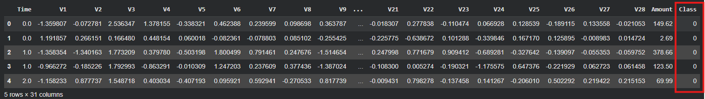
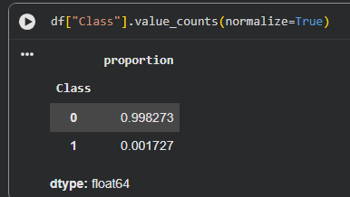
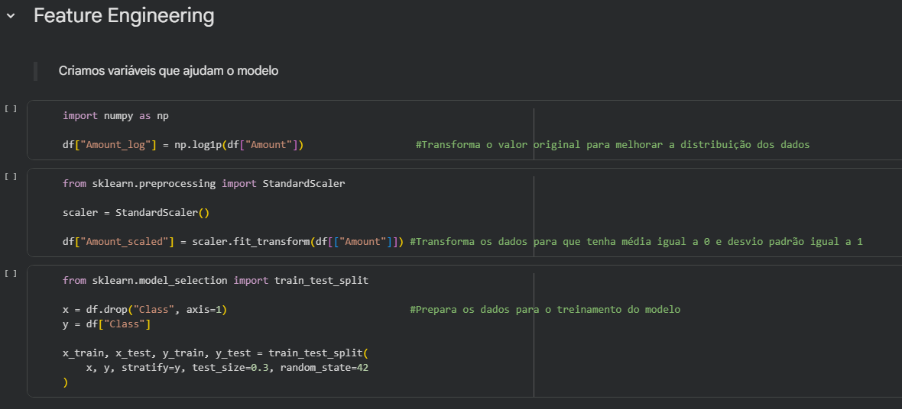
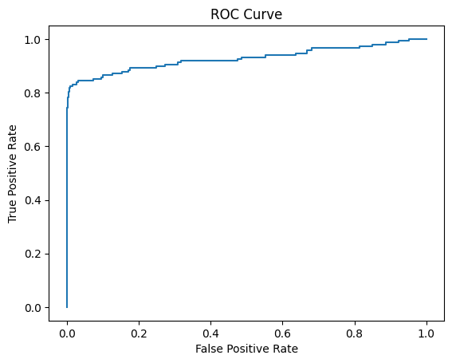
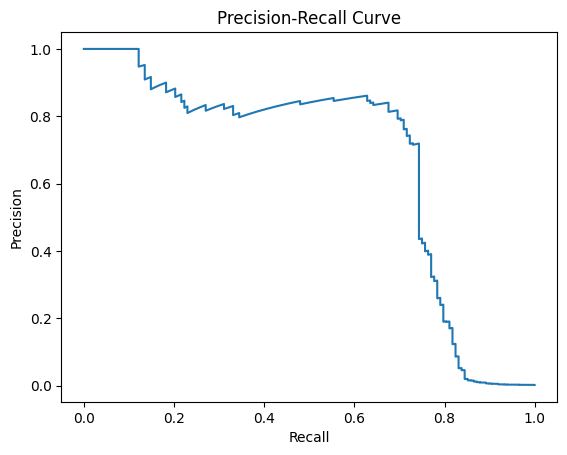
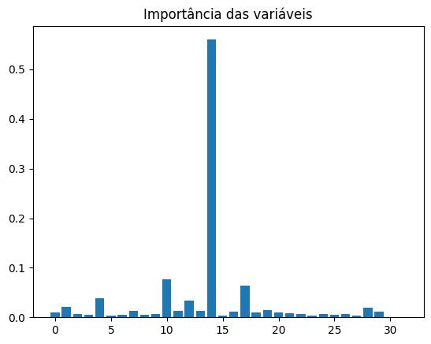
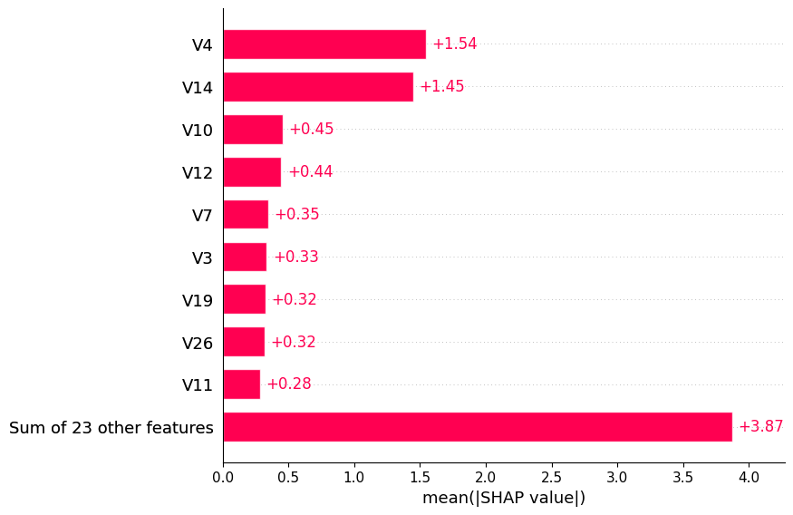

<h1 align="center">
Detecção de Fraudes com Machine Learning
</h1>

Projeto desenvolvido utilizando Machine Learning para identificação de transações fraudulentas.

<h2>Sobre o Projeto</h2>

Este projeto tem como objetivo aplicar técnicas de Machine Learning para identificar padrões suspeitos em transações financeiras e classificar possíveis fraudes.

A análise foi desenvolvida no Google Colab utilizando técnicas de preparação de dados, treinamento e avaliação de modelos preditivos.

<h2>Problema de Negócio</h2>

Fraudes financeiras geram prejuízos significativos para empresas e usuários. Detectar atividades suspeitas rapidamente pode reduzir perdas financeiras e aumentar a segurança.

<h2>Objetivos</h2>

<ul>

<li>Realizar análise exploratória dos dados;</li>

<li>Tratar valores inconsistentes;</li>

<li>Treinar modelos de Machine Learning;</li>

<li>Avaliar desempenho utilizando métricas;</li>

<li>Identificar padrões associados a fraudes.</li>

</ul>

<h2>Tecnologias Utilizadas</h2>

<ul>

<li>Python</li>

<li>Google Colab</li>

<li>Pandas</li>

<li>Numpy</li>

<li>Matplotlib</li>

<li>Scikit-Learn</li>

</ul>

<h2>Etapas Desenvolvidas</h2>

<ol>

<li>Importação das bibliotecas;</li>

<li>Carregamento dos dados;</li>

<li>Tratamento dos dados;</li>

<li>Análise exploratória;</li>

<li>Treinamento do modelo;</li>

<li>Avaliação dos resultados;</li>

<li>Conclusões.</li>

</ol>

<h2>Sobre os dados e método utilizados</h2>

O modelo utilizado neste projeto foi a <b>Regressão Logística</b>, técnica amplamente aplicada em problemas de classificação binária.

O conjunto de dados utilizado consiste em registros de transações financeiras, contendo diferentes variáveis relacionadas às operações realizadas. Entre os atributos disponíveis, a variável <b>Classe</b> foi utilizada como variável alvo, sendo responsável por classificar as transações em:

<ul>
<li><b>0:</b> transação legítima (não fraudulenta);</li>
<li><b>1:</b> transação fraudulenta.</li>
</ul>

A Regressão Logística foi aplicada para identificar padrões presentes nos dados e estimar a probabilidade de uma transação pertencer à categoria de fraude, permitindo a classificação entre operações legítimas e suspeitas.

<h2> A necessidade de diferentes métricas</h2>

Após a aplicação do modelo no conjunto de dados, a acurácia pode apresentar valores elevados, indicando um alto número de previsões corretas de transações legítimas. À primeira vista, esse resultado pode sugerir um bom desempenho do modelo. No entanto, ao analisar a distribuição do dataset, observa-se um forte desbalanceamento entre as classes, com predominância de transações não fraudulentas e uma quantidade muito reduzida de casos de fraude.

Esse cenário pode levar a uma interpretação equivocada da performance do modelo, uma vez que a acurácia não é suficiente para avaliar adequadamente problemas desbalanceados. Em situações como essa, um modelo pode atingir alta acurácia mesmo sendo incapaz de identificar corretamente as fraudes, apenas por aprender a classificar a maioria das observações como classe majoritária.

Dessa forma, torna-se necessário o uso de outras métricas de avaliação, como precisão (precision), revocação (recall) e F1-score, que permitem uma análise mais equilibrada do desempenho do modelo. A precisão indica a proporção de previsões positivas que estão corretas, enquanto o recall avalia a capacidade do modelo de identificar corretamente as fraudes reais. Já o F1-score combina essas duas métricas, oferecendo uma visão mais robusta em cenários de desbalanceamento.

Por fim, também se destaca a importância de técnicas complementares, como o feature engineering, que consiste na criação e transformação de variáveis para melhorar a capacidade do modelo de aprender padrões relevantes nos dados, contribuindo assim para um desempenho mais consistente em dados reais e futuros.

p

<h2>Estrutura do Projeto</h2>

<pre><code>
deteccao-fraudes-machine-learning/
│
├── assets/
│   ├── capa.png
|   ├── class.png
│   ├── notebook-preview.png
│   ├── importancia-das-variaveis.png
│   ├── precision-recall.png
│   ├── roc-curve.png
│   └── shap-importance.png
│
├── notebooks/
│   └── deteccao_de_fraudes_em_transacoes.ipynb
│
├── data/
│   └── dataset_info.txt
│
└── requirements.txt

</pre></code>

<h2>Métricas e visualizações utilizadas</h2>

<h3>Curva ROC</h3>

<h3>Precisão e Recall</h3>

<h3>Importância das Variáveis</h3>

<h3>Interpretação com SHAP</h3>

<h2>Como Executar o Projeto</h2>

<ol>

<li>
Faça o download ou clone este repositório:
</li>

</ol>

<pre><code>
git clone https://github.com/seuusuario/deteccao-fraudes-machine-learning.git
</code></pre>

<ol start="2">

<li>
Abra o arquivo:
</li>

</ol>

<pre><code>
deteccao_de_fraudes_em_transacoes.ipynb
</code></pre>

<ol start="3">

<li>
Execute o notebook no Google Colab ou em ambiente Jupyter.
</li>

<li>
Execute as células sequencialmente para reproduzir os resultados.
</li>

</ol>

<h2>Conclusão</h2>

O desenvolvimento deste projeto permitiu compreender etapas importantes de um fluxo completo de Machine Learning aplicado à detecção de fraudes financeiras. 
  
Durante a implementação foram exploradas etapas como análise de dados, tratamento das informações, treinamento do modelo e interpretação dos resultados obtidos. Além da avaliação por métricas tradicionais, recursos visuais como curvas de desempenho e análise de importância das variáveis permitiram compreender quais fatores influenciaram as previsões realizadas pelo modelo.

Em suma, o projeto contribuiu para ampliar conhecimentos em análise de dados, modelagem preditiva e interpretação de modelos de aprendizado de máquina.

